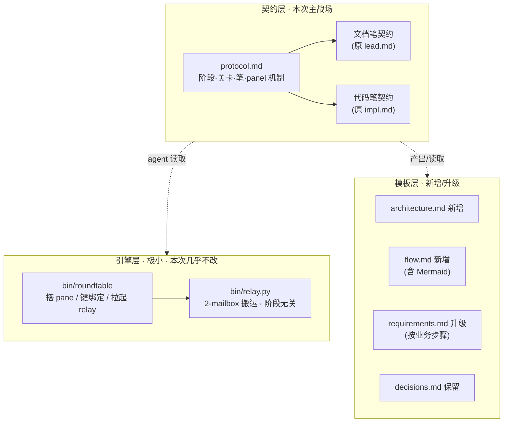
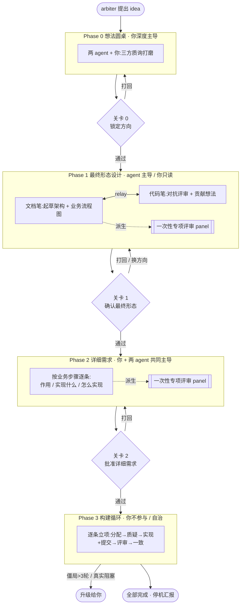
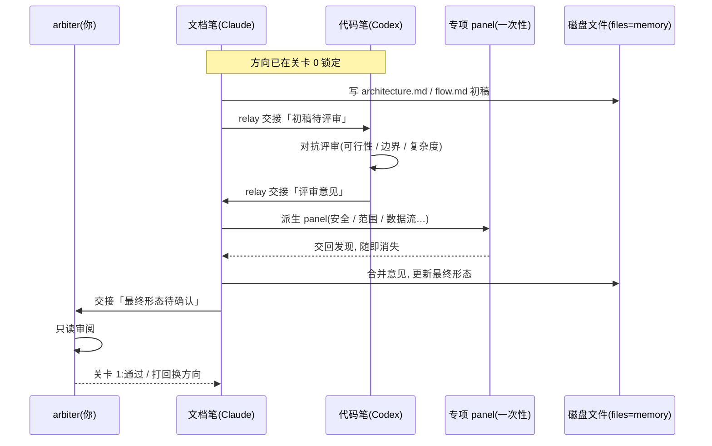
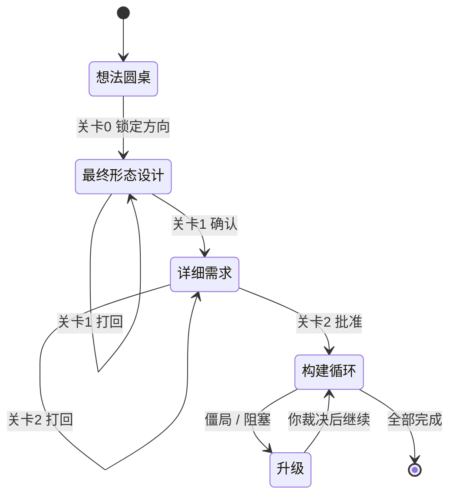
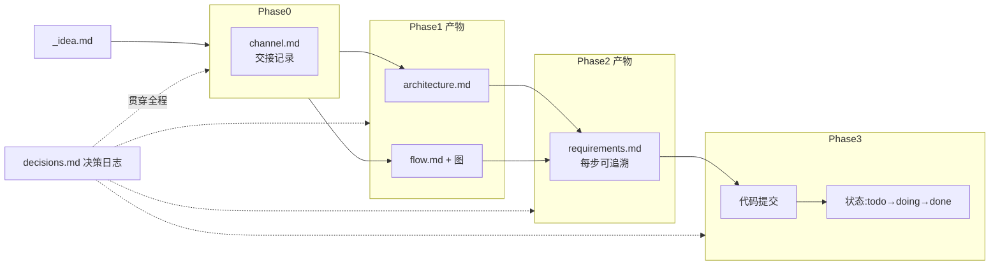
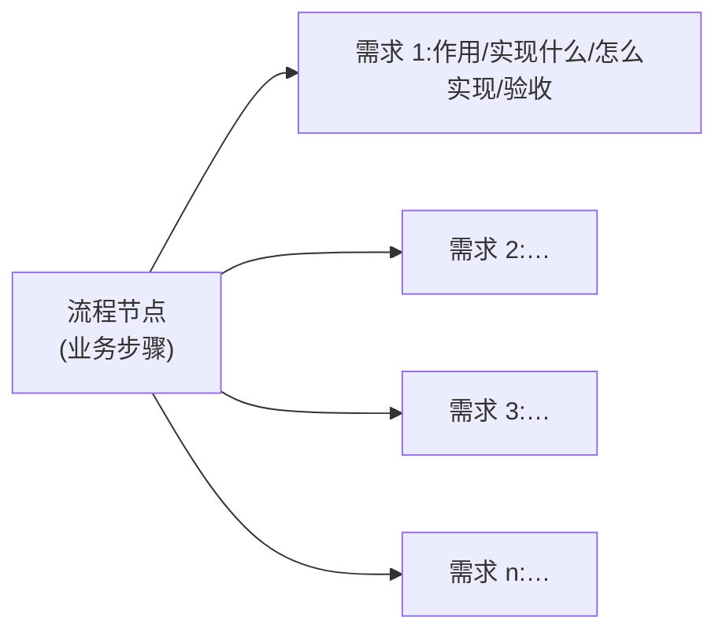

# 最终形态:为 roundtable 增加「前置设计流程」

> **历史说明:** 本文是 2026-06-22 Roundtable v2 前置设计流程的历史设计证据。
> 当前权威协议以 `prompts/protocol.md`、`prompts/xuan.md`、`prompts/su.md` 和
> `docs/design/roundtable/*` 为准；若本文术语或路径与当前文件冲突，以当前文件为准。

> **状态:** ② 最终形态设计 · **关卡 1 已通过(2026-06-22)** · 进入 ③ 详细需求
> **试点说明:** 本文档既是"给 roundtable 加前置设计流程"这个功能的设计稿,
> 也是新流程 ② 阶段产物的样板。命名(agent 角色名)按约定暂缓,文中用中性占位:
> **文档笔(Doc-pen / Claude Code)** 与 **代码笔(Code-pen / Codex)**。

---

## A. 一句话最终形态

把 roundtable 现有的"薄前端"(idea → 直接起草需求)扩成一条**有产物、有关卡、有视角覆盖**的设计流水线:
**想法圆桌 → 最终形态设计 → 详细需求 → 构建循环**,人类在三处把关,其余自治。
而这一切**几乎全部落在 prompt 契约与模板里**,引擎(relay + orchestrator)保持极小不变。

---

## B. 核心架构发现

roundtable 的关键事实:**"阶段 / 关卡 / 角色"不在 bash 里,而在 prompt 契约里。**

- `bin/relay.py` —— 只在 2 个 mailbox 之间搬消息,**阶段无关**(phase-agnostic)。
- `bin/roundtable` —— 只负责搭 tmux pane、装键绑定、拉起 relay,**不编码任何工作流**。
- 真正定义"怎么协作"的是 `prompts/protocol.md` + `prompts/lead.md` + `prompts/impl.md` + `templates/*`。

**推论:加这套前置流程 ≈ 90% 是契约与模板的改动,引擎几乎零改动。** 这与 README
"一个极小的中继"的调性一致——我们加的是**协议**,不是**机器**。



---

## C. 生产运行时业务逻辑流程

### C.1 端到端阶段流程



### C.2 一个阶段的交接时序(以 ② 为例)



### C.3 项目生命周期状态机



### C.4 数据流 · 文件即记忆



> 注：上图中的 `状态:todo→doing→done` 保留为 v2 构建设计历史证据；当前需求状态生命周期已由
> `prompts/protocol.md` / `## Requirement Status Lifecycle` 取代。

### C.5 需求粒度:一个流程节点 → 多条需求(n:1)

**修正(关卡 1 反馈):** 需求**比流程节点更细**。② 流程图的一个节点是一个"业务步骤",
它在 ③ 里会**展开成很多条需求**;追溯关系是 **多条需求 → 同一个流程节点(n:1)**,
而不是一一对应。目标不是"节点对齐",而是 **每一条需求都在文档里被单独、清晰、完整地描述**。



每条需求是**原子单位**,含字段:`编号` · `所属流程节点(追溯)` · `作用/价值` · `实现什么` ·
`怎么实现` · `验收标准` · `状态`。

---

## D. 关卡模型(单关卡 → 三关卡)

| 关卡 | 位置 | 你做什么 | 否决后 |
|---|---|---|---|
| **关卡 0** | ① 之后 | 确认"就这个方向" | 退回 ① 继续打磨 |
| **关卡 1** | ② 之后 | 只读审阅最终形态,认可方向 | 打回 ②,可换大方向 |
| **关卡 2** | ③ 之后 | 批准每步详细需求(原 Gate A) | 打回 ③ 逐条改 |

> 这替换了 README 现有原则"arbiter 唯一一道关卡"。新原则:
> **人类在"方向锁定 → 最终形态确认 → 详细需求批准"三处把关,其余自治。**

---

## E. 角色与"笔"模型

设计阶段两个 agent **对称**:都贡献想法、都互相反驳。唯一**贯穿全程的非对称**是**持哪支笔**:

| | 玄(文档笔 / Claude) | 素(代码笔 / Codex) |
|---|---|---|
| 持笔对象 | 一切**文档**(架构 / 流程 / 需求) | 一切**代码** |
| 永不做 | 写生产代码 | —— |
| 一贯姿态 | 综合、结构化、评审 | 先质疑、再实现 |
| P0 想法圆桌 | 共创 + 收敛 | 共创 + 反驳 |
| P1 最终形态 | **持笔起草** + 派生 panel | 对抗评审 + 反驳架构 |
| P2 详细需求 | 持笔逐条起草 → 你和代码笔挑战 → 你拍板 | 对抗评审 + 共同主导 |
| P3 构建循环 | 评审 | **持笔实现** + 提交 |

**P2 的分工按字段切分(关卡 1 反馈):**

| 字段 | 谁主导 |
|---|---|
| 作用 / 价值(WHY) | **你** + 两 agent |
| 实现什么(WHAT) | **你** + 两 agent |
| 怎么实现(HOW) | 主要由两 agent 决定 |
| 验收 / 状态 | 两 agent 起草,你拍板 |

> **覆盖 = 100%(关卡 1 反馈):** ③ 里**每一条**需求你都参与(在 WHY/WHAT 上拍板),**无一条被跳过**。
> 为让"逐条参与"可承受:两 agent 先把每条的 WHY/WHAT 草案备好 → 你逐条确认或修改 → HOW 交还两 agent。

### E.1 专项评审 panel 跑在哪个环节

panel **不是独立阶段**,而是嵌在 ② 和 ③ 内部、**"两 agent 收敛后、交给你之前"**的最后一道自动质检:

```
两 agent 反复讨论 → 文档笔产出"准最终稿"
        → 文档笔派生一组一次性专项评审子 agent(可行性/安全/范围/数据流/运维…)
        → 各审一遍, 交回 blind spot, 随即消失
        → 文档笔补完 → 才交给你过关卡
```

所以你在关卡上看到的稿子,**已经被多视角扫过**。子 agent 由持笔方内部派生,**不碰 relay**,
人类可见的圆桌仍是 2 个 pane。
**强制 / 按需:** 建议 **②(架构层,影响最大)强制跑;③ 按需**(持笔方判断某条需求够复杂/够高风险才跑)。

### E.2 命名(已定:玄 / 素)

名字**不锚角色**,取道家对等互补意象。两 agent 是对等共创者(都质疑、都贡献),其对话碰撞而生设计。

| 名 | 是谁 | 取义 |
|---|---|---|
| **玄** | Claude Code(原 lead) | "玄之又玄,众妙之门":幽深、未形 |
| **素** | Codex(原 impl) | "见素抱朴":质朴、本真;亦合 roundtable 极简调性 |
| (人) | arbiter(你) | —— |

> 玄/素 皆不含尊卑,不编码"谁写代码"。`玄=Claude / 素=Codex` 仅为稳定标签,如需对调随时可换。

---

## F. 改动清单(最终形态对仓库意味着什么)

| 文件 | 改动 | 量级 |
|---|---|---|
| `prompts/protocol.md` | 重定义阶段 0–3、三关卡、笔模型、panel 机制、新产物的重启恢复 | **大** |
| `prompts/lead.md`(待改名) | 各新阶段职责;P1 持文档笔并派生 panel;P2 与人共同主导 | 中 |
| `prompts/impl.md`(待改名) | 全程 challenge-first;P0–P2 贡献+反驳;P3 唯一实现者 | 中 |
| `templates/architecture.md` | **新增**:最终形态架构文档骨架 | 中 |
| `templates/flow.md` | **新增**:业务流程文档骨架 + 四类 Mermaid 占位 | 中 |
| `templates/requirements.md` | **升级**:按流程节点分组,每个节点下展开**多条原子需求**(n:1),每条含 编号/所属节点/作用/实现什么/怎么实现/验收/状态 | 中 |
| `templates/decisions.md` | 保留(已有 Phase 列) | 微 |
| `.roundtable/kickoff-*.txt` | 更新 kickoff,提示新阶段与关卡 | 小 |
| `README.md` / `README.en.md` | 更新工作流章节(单关卡→三关卡;新增 P1/P2) | 中 |
| `bin/roundtable` | 仅 `init` 可能多 scaffold 两个新模板;无工作流逻辑改动 | 小 |
| `bin/relay.py` | **不改**(阶段无关) | 无 |

---

## G. 关卡 1 决议(已锁定)

1. **三道正式关卡** —— 方向锁定 / 最终形态确认 / 详细需求批准,均为正式 gate。✅
2. **③ 形态:** 文档笔逐条起草 → 你和代码笔挑战 → 你拍板;**按字段分工**——"作用/实现什么"你参与,"怎么实现"主要由两 agent 决定;**你参与每一条需求,无一跳过**。✅
3. **panel 位置:** 嵌在 ②/③ 内,"收敛后、交你前"的自动质检;② 强制、③ 按需。✅
4. **粒度修正:** 需求**比流程节点细**,一个节点 → 多条需求(n:1);每条需求单独清晰描述。✅
5. **命名:已定 玄 / 素**(玄=Claude,素=Codex;仅为标签,不编码角色)。✅
