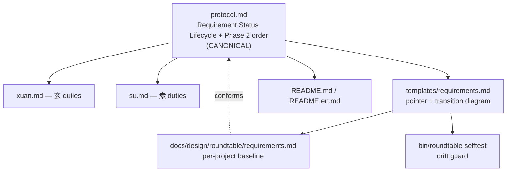

# Architecture — source-of-truth model for the status lifecycle + Phase 2 order

> Phase 1 final-form artifact. **🔒 Gate 1 locked 2026-06-23** (arbiter approved; decision #4
> stronger selftest adopted — see `decisions.md`). Reopen Gate 1 explicitly to change this;
> reopen Gate 0 if the direction itself must change.
> This is an information/contract architecture: it defines **where** each rule lives and
> **how** every surface references the canonical definition, so the status vocabulary and
> Phase 2 order cannot drift across files again.
> Stays inside the 🔒 Gate 0 direction (`.roundtable/_idea.md`).

## 1. Problem the architecture solves

The status vocabulary drifted across three surfaces (`protocol.md` had only `pending`;
`templates/requirements.md` listed five tokens but defined one and contradicted itself;
the live `requirements.md` used a different three) and the Phase 2 order was unwritten. The
fix is structural: **one canonical definition, every other surface references or derives it,
none redefine it**, plus a selftest that catches silent drift.

## 2. Surfaces and responsibilities

| Surface | Holds | Relationship to canonical |
|---|---|---|
| `prompts/protocol.md` → **new "Requirement Status Lifecycle" section** | **CANONICAL**: the four states + `blocked`, all transitions, the group-rollup precedence, and the atomic-rows-authoritative rule | source of truth |
| `prompts/protocol.md` → Phase 2 section | the per-group loop order, the hard "素-before-arbiter" invariant, panel-before-confirmation, the cross-group-panel bound | authoritative for order |
| `prompts/protocol.md` → Restart Recovery | recovery references the **full** lifecycle set (not a `pending`/`doing` subset); on restart 玄 re-confirms 素's challenge before presenting (preserves the hard invariant for in-flight groups) | within already-in-scope protocol.md |
| `prompts/xuan.md` | 玄 duties: draft → send to 素 **before** arbiter confirmation; status flips **follow** `protocol.md` / Requirement Status Lifecycle (by reference, no re-enumeration of the state set) | references protocol |
| `prompts/su.md` | 素 challenge + restart duties **reference** the canonical lifecycle in `protocol.md`; any state named operationally (e.g. surfacing `doing`/`blocked` rows) carries a "per the Requirement Status Lifecycle in `protocol.md`" tag, so it reads as illustration, not a local authoritative list | references protocol |
| `templates/requirements.md` | a one-line pointer to the protocol section + a compact transition diagram + a "group derived / atomic authoritative" note; atomic default status = `pending` | references protocol; copied into each new project |
| `docs/design/roundtable/requirements.md` (per project) | the live baseline, using the canonical vocabulary | conforms to template + protocol |
| `README.md` / `README.en.md` | workflow teaching, incl. "challenged/converged before arbiter confirmation" | informational mirror |
| `bin/roundtable` selftest | drift guard via stable template sentinels (`<!-- rt-lifecycle-pointer/-diagram/-note -->`) + atomic default `pending`, plus one check that `protocol.md` contains the canonical heading the pointer names (pointer-target-exists). Guards template-presence + pointer-resolves — not cross-surface agreement | enforcement |
| `docs/design/roundtable/decisions.md` | gate verdicts + rationale | record |

## 3. Reference graph

All solid edges are "references / is derived from". No surface other than `protocol.md`
defines the states or the order. Role prompts may additionally *observe* (not define) live
`requirements.md` rows during Phase 3 — an information-only edge, not a definitional one.

## 4. Drift-prevention principle

- **One canonical definition** in `protocol.md`. Everything else references or derives.
- **Role prompts reference, never enumerate.** `xuan.md` / `su.md` point to the canonical
  section by name; they do not list the state set as a definition — a partial list (e.g. one
  that omits `done`) is itself a drift surface. Any state named operationally must carry a
  "per the Requirement Status Lifecycle in `protocol.md`" tag, so it reads as an illustration
  of the canonical set, never a local authoritative list. Such operational mentions are
  observation-only (reading live rows), not definitional.
- **Template carries pointer + diagram, not full prose** — full duplication would drift
  again; pointer-only would be too weak for a standalone requirements file copied into a
  project. The compact middle (pointer + transition diagram + derived-group note) is
  self-sufficient yet non-authoritative.
- **selftest guards via stable sentinels and verifies the pointer resolves.** The template
  embeds explicit sentinels (`<!-- rt-lifecycle-pointer -->`, `<!-- rt-lifecycle-diagram -->`,
  `<!-- rt-lifecycle-note -->`) plus a `pending` atomic default; selftest asserts each, **and**
  that `protocol.md` contains the canonical-section heading the pointer names — so a silently
  removed/renamed canonical section fails the check, not just a missing template string.
  **Reach of the guard:** it proves template-presence + pointer-target-exists; it does **not**
  prove cross-surface *agreement* (template diagram still matching protocol's, no role prompt
  re-enumerating states) — that stays a review/grep responsibility. This refines Gate 0
  decision #4 from "pointer present" to a sentinel-based template guard + pointer-target check
  (surfaced to the arbiter at Gate 1).

## 5. Frozen boundaries / non-goals

- Engine (`bin/roundtable`, `bin/relay.py`) unchanged **except** the single selftest
  assertion (Gate 0 decision #4). No refactor.
- No new states, gates, panes, or relay routes. Phase 0 / 1 / 3 behavior frozen.
- Historical evidence preserved and annotated forward, not rewritten: the completed
  `docs/design/roundtable/requirements.md` row statuses (G1–G12 `done`) and the
  `docs/design/front-end-pipeline-final-form.md` data-flow diagram.
