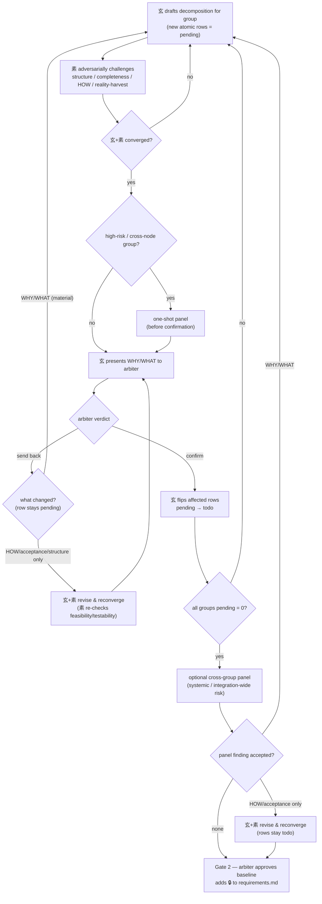

# Runtime flow — Phase 2 sequence + requirement status lifecycle

> Phase 1 final-form artifact. **🔒 Gate 1 locked 2026-06-23** (arbiter approved; decision #4
> stronger selftest adopted — see `decisions.md`). Reopen Gate 1 explicitly to change this;
> reopen Gate 0 if the direction itself must change.
> Business-runtime perspective: nodes are steps in the roundtable's Phase 2 process and
> states in the requirement lifecycle — not development tasks.
> Stays inside the 🔒 Gate 0 direction (`.roundtable/_idea.md`).

## 1. What this flow covers

Two coupled runtime flows of the roundtable's **Phase 2 (detailed requirements)**:

- **F-1 — Phase 2 per-group loop**: the order in which a flow-node group moves from draft
  to arbiter-confirmed, and on to Gate 2.
- **F-2 — Requirement status lifecycle**: the state machine each atomic requirement row
  follows, which the loop drives.

Phase 0, Phase 1, and Phase 3 behavior is unchanged; this flow only makes Phase 2's order
explicit and unifies the status vocabulary.

## 2. F-1 — Phase 2 per-group loop

Each runtime flow node (from the locked `flow.md` of the project under design) expands into
a **group** of atomic requirements. Groups run this loop; Gate 2 is a single baseline gate
after every group reaches `pending = 0`.

On a **send-back** the row always stays `pending` (it was never confirmed); the branch only
sets how much re-work happens, and every changed-draft path passes back through 素 before
re-presentation — never the arbiter on an unseen change. A send-back that names **no
actionable change** is arbiter indecision, not a flow edge: 玄 seeks clarification from the
arbiter on what must change rather than silently re-presenting the identical draft. There is
no 玄→arbiter re-present path that both skips 素 and carries no state change.

On a **cross-group panel** finding that is accepted: a WHY/WHAT change returns the affected
rows to `pending` and re-enters the group loop; a HOW/acceptance-only change keeps rows
`todo`, is revised and reconverged by 玄+素, then proceeds to Gate 2. **Bound:** the
cross-group panel re-runs only for **new, undispositioned** systemic risk. After a WHY/WHAT
re-entry the affected rows go back through the group loop and K runs again automatically once
`pending = 0` is re-reached; a HOW/acceptance-only revision reconverges and proceeds to Gate 2
(玄 may re-run K only if the revision introduces a new, undispositioned risk). If the **same
or substantially the same** risk/fix cycles through the panel repeatedly, use the standard
disagreement/escalation guardrail rather than auto-running another pass — distinct new risks
legitimately re-run K; repeated rediscovery or rejection of the same risk is the escalation
case.

**Hard invariant:** node A→B→C must complete (素 challenged, converged) before node F. 玄
never presents an un-challenged, un-converged draft to the arbiter.

**Panel timing.** Three panel positions, with different effects on confirmation:

- **Pre-confirmation group panel (node E)** — runs *before* arbiter confirmation, so the
  arbiter only confirms panel-hardened requirements. No confirmation exists yet to disturb.
- **Optional cross-group panel (node K)** — runs *after* row confirmation but *before*
  Gate 2, with the disposition branch shown in the diagram: an accepted WHY/WHAT finding
  returns rows to `pending`; an accepted HOW/acceptance-only finding keeps rows `todo`
  (revise + reconverge); no accepted finding → Gate 2.
- **Any other late/post-confirmation panel** (a new risk surfaces, or the arbiter requests
  one) — invalidates confirmation **only when the accepted finding changes WHY/WHAT**
  (affected rows → `pending`, re-enter the group loop). A finding that changes only
  HOW/acceptance keeps rows `todo`; 玄+素 revise and reconverge without re-confirmation.

In short, a panel disturbs confirmation **iff** an accepted finding changes WHY/WHAT —
never merely because it ran after confirmation.

## 3. F-2 — Requirement status lifecycle

```mermaid
stateDiagram-v2
  [*] --> pending: 玄 drafts atomic requirement
  pending --> pending: arbiter send-back (revise per F-1; stays pending)
  pending --> todo: arbiter confirms WHY/WHAT
  todo --> doing: 素 starts build (Phase 3)
  doing --> done: built + 玄/素 both agreed
  doing --> blocked: blocker hit (needs reason + owner/condition + re-entry)
  blocked --> doing: re-entry condition met
  todo --> pending: Gate 2 send-back — only if WHY/WHAT must change
  done --> [*]
```

State meanings:

- **`pending`** — arbiter has not confirmed WHY/WHAT. Gate 2 entry counts these.
- **`todo`** — arbiter-confirmed, awaiting build.
- **`doing`** — building (Phase 3).
- **`done`** — built and both sides agreed.
- **`blocked`** — a `doing` item that cannot proceed. Valid **only** after `doing`; carries
  a blocker reason, an owner/external condition, and an explicit re-entry condition. Exit is
  `blocked → doing`.

`blocked` is **not** a generic "cannot proceed" bucket:

- a `pending` item blocked on a missing decision stays `pending` (record the question in
  open questions / `decisions.md`);
- a `todo` item blocked by dependency/sequencing stays `todo` (confirmed, not yet assignable).

**Confirmed vs locked:** `todo` (per-row, confirmed) is independent of `🔒` (baseline-level,
added at Gate 2). The lock is a property of the requirements file, never a per-row state.

The terminal `done → [*]` means **no further action** — the row stays in the baseline file
marked `done`; it is not removed from the file.

### Row mutation outside the state machine

Deleting, descoping, or replacing a requirement row is **not** a status transition and has
no edge in F-2:

- Removing or descoping a row is a content edit, not a state change. Record the rationale in
  `decisions.md` or the requirements open-questions/history area.
- If an existing `todo` or `done` row's WHY/WHAT must change, **either** return that row to
  `pending` (re-confirm) **or** create a replacement `pending` row — never silently rewrite
  a confirmed/done row's WHY/WHAT in place.
- HOW/acceptance refinements to a `todo`/`done` row that do not touch WHY/WHAT are content
  edits handled by 玄+素 (no re-confirmation), and do not change the row's status.

## 4. Group rollup (derived display state)

Atomic requirement rows are the **source of truth**; a group's status is **derived display
only**. The `Pending` column = count of atomic rows whose status is `pending`. Gate 2 is
keyed to the atomic pending count, never to group labels.

Rollup precedence (first match wins):

1. `pending` — any atomic row is `pending`, **or** the node is listed but not yet decomposed
   (no atomic rows yet). "Not yet decomposed" is a transient display state, not a machine
   state: once decomposition begins, every new atomic row enters `pending` per F-2.
2. `blocked` — any atomic row is `blocked`.
3. `doing` — any row is `doing`, **or** the group is partially built (`done` mixed with `todo`).
4. `done` — all rows are `done`.
5. `todo` — all rows are confirmed and unstarted (`todo`).

This keeps restart recovery conservative: a partially built group normally never reads as
untouched backlog.

**Gate 2 reopen on a partially built baseline.** The relock may carry existing `done` rows
plus changed/new `todo` rows, as long as no row is `pending`. Two operational rules:

- **`done`-row revalidation (precondition):** before relocking, 玄+素 must check each carried
  `done` row against the changed/new `todo` rows for dependency/assumption impact. An impacted
  `done` row is explicitly returned to `pending`/`todo` (re-confirm or rebuild) and may not
  ride the lock as `done`. Record the check in `decisions.md`.
- **Mixed-rollup caveat:** a post-reopen group mixing `done` with a new `pending` row rolls up
  `pending` (rule 1) — the one case where the "partially built ≠ backlog" intent is overridden.
  After any reopen, recovery must inspect atomic rows (always authoritative), not the group
  label.

## 5. Restart during Phase 2

The per-group loop position (drafted / challenged / converged) is **not** a row status —
every in-flight row in an actively-decomposing group reads `pending`, whether it is freshly
drafted and un-challenged, challenged but not converged, or converged and awaiting the
arbiter. The hard invariant ("素 challenged before 玄 presents") therefore lives in the loop,
not in a persisted row.

To preserve the invariant across a restart: 玄 treats 素's challenge/convergence for a group
as **not done** unless it is evidenced in `channel.md` / `decisions.md`; when in doubt 玄
re-confirms with 素 (re-runs node B) before presenting. `channel.md` is evidence, but the
conservative default is to re-challenge, never to present an unverified draft. This requires
`protocol.md`'s Restart Recovery step to reference the full lifecycle set
(`pending/todo/doing/done/blocked`), not just a `pending`/`doing` subset.

## 6. Frozen boundaries

- Phase 0 / Phase 1 / Phase 3 behavior is unchanged.
- No new mailbox STATUS values, no new gates, no new panes/relay routes.
- One status column only — no separate "confirmation" column.
