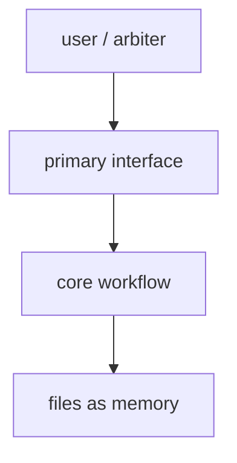

# Architecture — <project / feature name>

> Produced in Phase 1 by 玄 + 素 after Gate 0 locks the direction.
> Default tracked location: `docs/design/roundtable/architecture.md`.
> Runtime handoff state stays in `.roundtable/`.

**Status:** draft | converged | locked
**Related direction:** `.roundtable/_idea.md` / decisions entry / commit link
**Gate 1:** pending | approved | sent back

## 1. 回链已锁方向

Summarize the Gate 0 direction in a self-contained way. Include:

- **核心问题:** …
- **目标用户 / 价值:** …
- **一句话形态:** …
- **明确非目标:** …
- **关键未决问题:** …

If this architecture changes the locked direction or violates a non-goal, stop and reopen Gate 0.

## 2. 组件·分层

Describe the final system shape at the architecture level.

| Component / layer | Responsibility | Inputs | Outputs | Owner / notes |
|---|---|---|---|---|
| … | … | … | … | … |

## 3. 关键设计取舍

Record tradeoffs that affect downstream requirements.

| Decision | Options considered | Chosen approach | Rationale | Risk / mitigation |
|---|---|---|---|---|
| … | … | … | … | … |

## 4. 对现有的改动清单

List concrete repository surfaces expected to change.

| Area / file | Change | Why | Requires migration? |
|---|---|---|---|
| … | … | … | no |

## 5. 开放问题

Open questions must be resolved or explicitly deferred before Gate 1.

| Question | Impact if unresolved | Owner | Status |
|---|---|---|---|
| … | … | … | pending |
