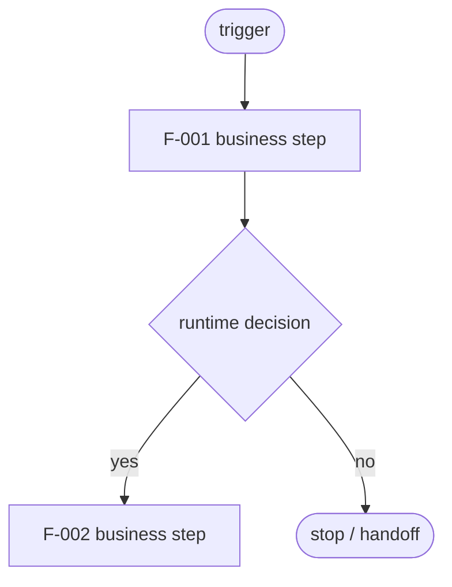
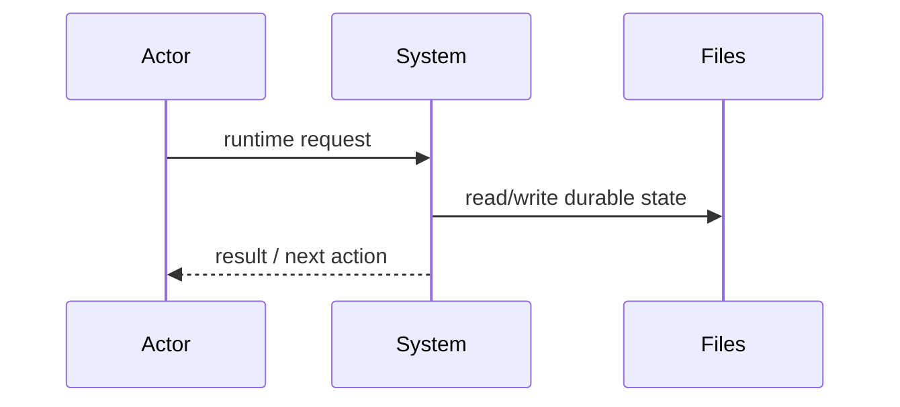
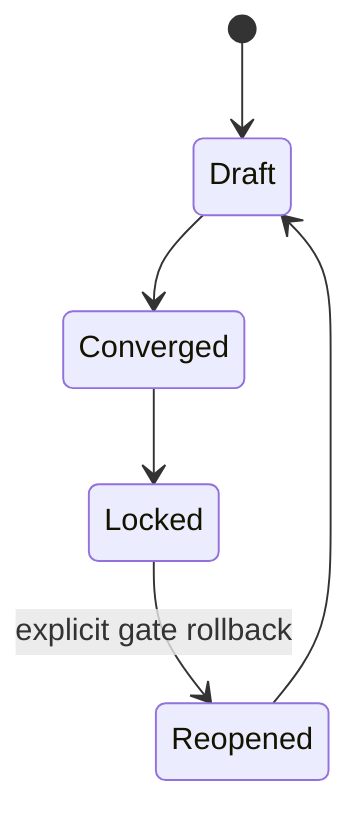
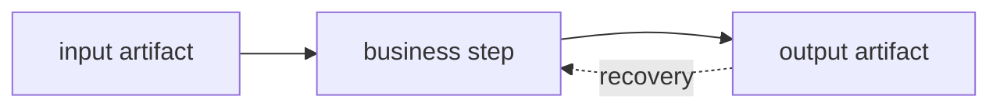

# Runtime Flow — <project / feature name>

> Produced in Phase 1 by 玄 + 素 after Gate 0 locks the direction.
> Default tracked location: `docs/design/roundtable/flow.md`.
> **节点 = 业务步骤(不是开发步骤)**. These nodes are the source for Phase 2 requirement groups.

**Status:** draft | converged | locked
**Related architecture:** `docs/design/roundtable/architecture.md`
**Gate 1:** pending | approved | sent back

## 1. 流程节点清单

Every business step in the runtime flow should appear here before Phase 2 begins.

| Node id | Business step | Actor / system | Input | Output | Notes |
|---|---|---|---|---|---|
| F-001 | … | … | … | … | … |

## 2. 运行时流程图(必填)

## 3. 时序图(按需)

Use this when multiple actors or services exchange messages over time.

## 4. 状态机(按需)

Use this when phase, lock, approval, or retry state matters.

## 5. 数据流(按需)

Use this when durable files, APIs, or derived artifacts carry important data.

## 6. Phase 2 拆解提示

For each node above, Phase 2 expands one business step into one or more atomic requirements.
Traceability is n:1: many requirements may point back to the same flow node.
